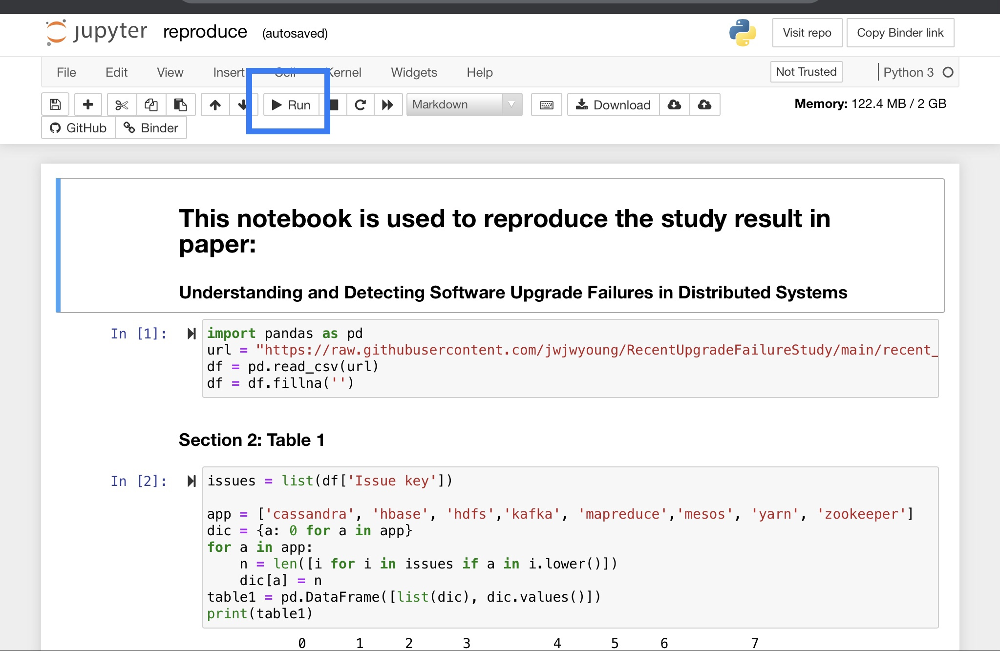

# RecentUpgradeFailureStudy

This is the repo for the issues of recent upgrade failure and how to generate tables in section 3, 4, and 5 in companion paper Understanding and Detecting Software Upgrade Failures in Distributed Systems

# how to run it
open https://mybinder.org/v2/gh/jwjwyoung/RecentUpgradeFailureStudy/85fd3e055c8d690744ac450e0a15e21ba2fde010

click reproduce.ipynb

run each cell from begining as shown in the blue box of the picture below 

